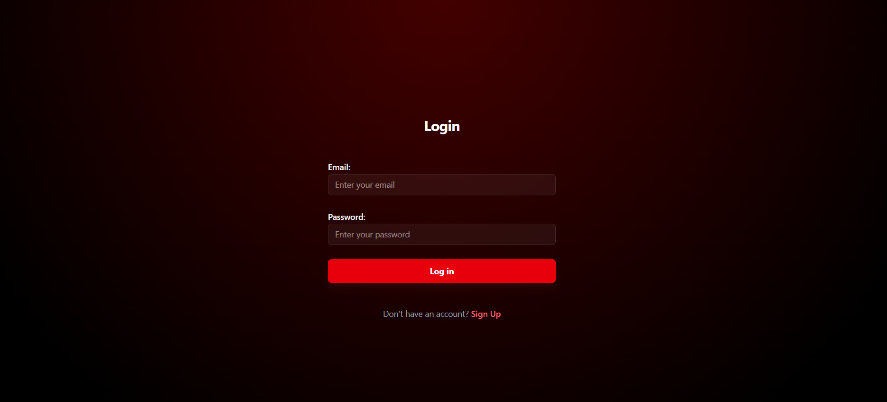
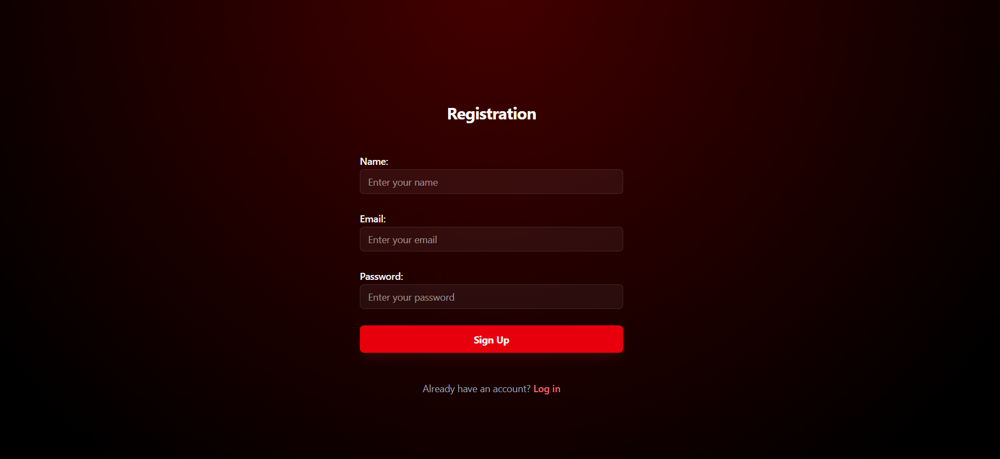
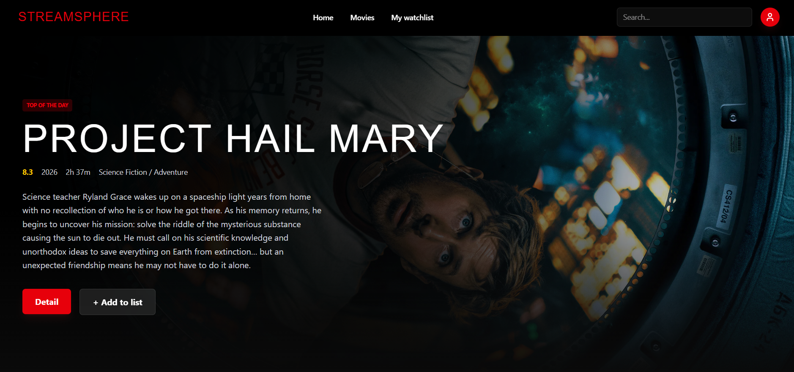
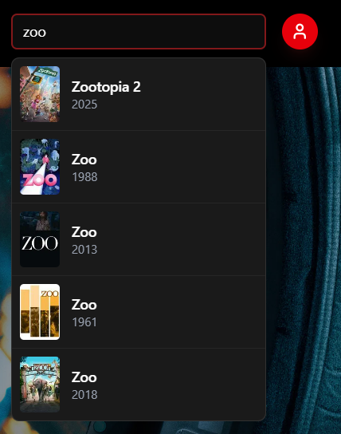
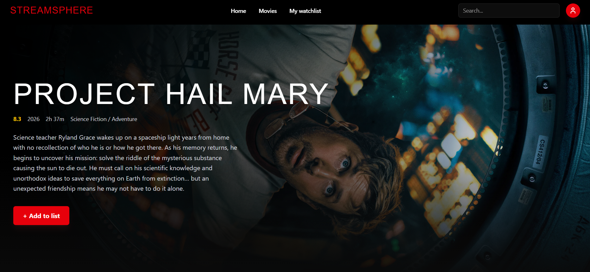
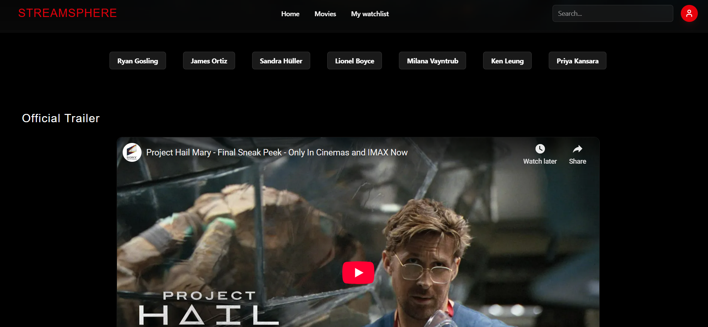
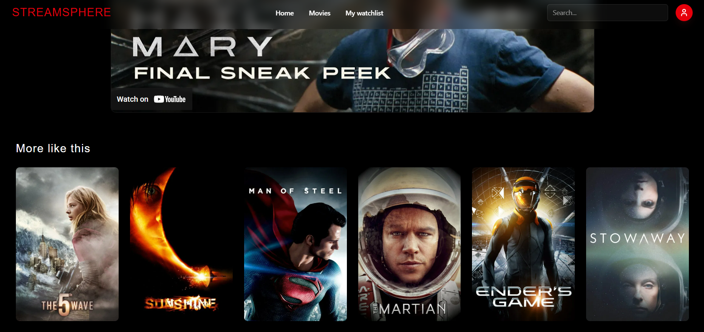
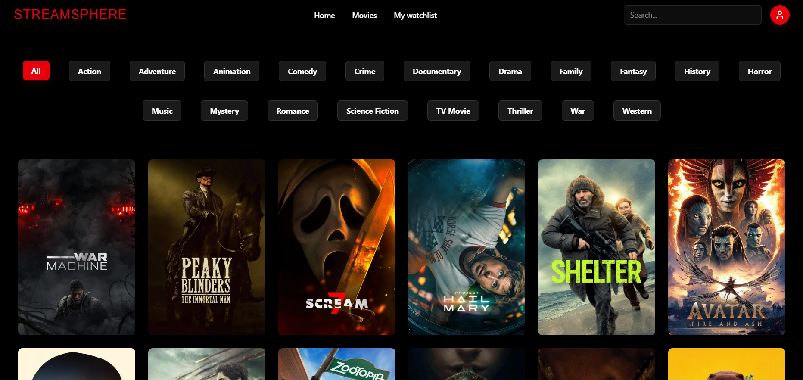
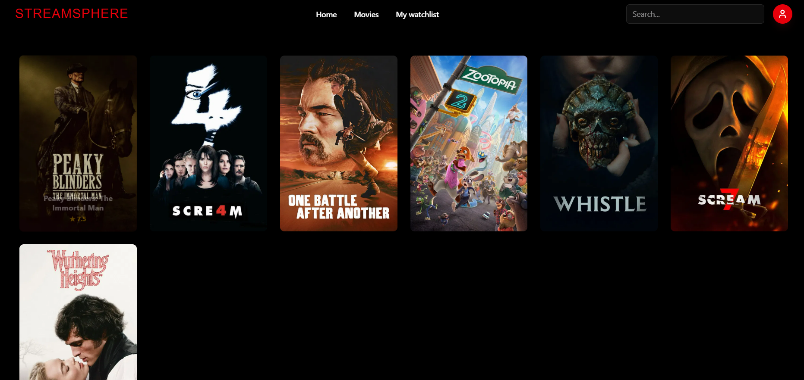

# 🎬 StreamSphere — Movie Discovery & Tracking Platform

**StreamSphere** — це сучасна платформа для пошуку та каталогізації фільмів. Проєкт реалізовано як Fullstack додаток, що дозволяє користувачам досліджувати світ кіно: переглядати трейлери, вивчати акторський склад, стежити за рейтингами та формувати персональний список "Must Watch".

## Скріншоти проєкту

### Авторизація та Реєстрація
Безпечний вхід до системи та створення нових аккаунтів для доступу до персональних можливостей.

<p align="center">
  
  
</p>

### Головна сторінка та Пошук
Тут користувачі можуть бачити трендові фільми, фільтрувати їх за жанрами та використовувати швидкий пошук із випадаючим списком результатів.

<p align="center">
  
  
</p>

---

### Деталі фільму
Повна інформація про обраний фільм: опис, акторський склад, рейтинг та можливість перегляду трейлера.

<p align="center">
  
  
  
</p>

---

### Сторінки фільмів та Список обраного
Зручна сітка фільмів з пагінацією ("Load More") та персональний список Watchlist, синхронізований з базою даних.

<p align="center">
  
  
</p>

## Основні можливості

* **Динамічний контент:** Інтеграція з TMDB API для отримання найсвіжіших даних про фільми.
* **Персоналізація:** Створення аккаунту, авторизація через JWT та власний Watchlist.
* **Фільтрація:** Зручна навігація по жанрах.
* **Адаптивність:** Повністю чуйний інтерфейс з використанням Tailwind CSS.


## Технологічний стек

### Frontend
* **React 19**
* **TypeScript** 
* **Tailwind CSS** 
* **React Router Dom** 
* **Axios**
* **Lucide React**
* **React Hot Toast** 

### Backend
* **Node.js** + **Express** 
* **MongoDB** + **Mongoose**
* **JSON Web Tokens (JWT)**
* **Bcrypt**
* **Cors**

## Як запустити проєкт локально

### 1. Клонування репозиторію
```bash
git clone https://github.com/Liubka-Nikoletta/streamSphere.git
cd streamSphere
```
### 2. Налаштування серверної частини (Backend)
```bash
cd server
npm install
```
Створіть файл .env у папці server та додайте наступні змінні:

```bash
PORT=5000
MONGO_URI=your_mongodb_connection_string
JWT_SECRET=your_secret_key_for_jwt
```
Запустіть сервер:

```bash
npm run dev
```

### 3. Налаштування клієнтської частини (Frontend)
Відкрийте нове вікно терміналу:

```bash
cd client
npm install
```
Створіть файл .env у папці client та додайте свій токен TMDB:

```bash
VITE_TMDB_TOKEN=your_tmdb_bearer_token
VITE_API_BASE_URL=http://localhost:5000/api
```
Запустіть клієнт:

```bash
npm run dev
```
